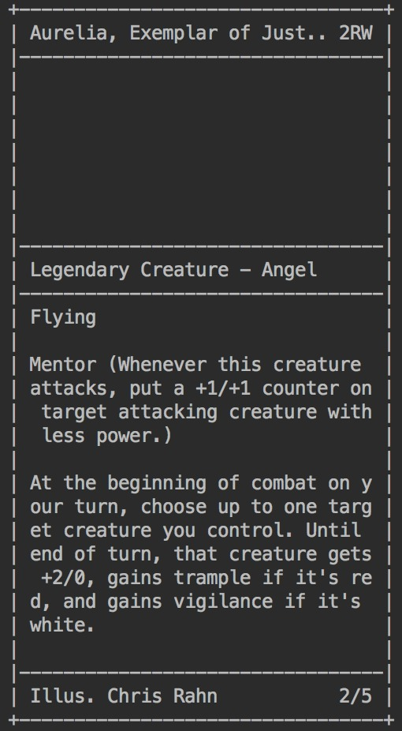

# MTG Spoiler Bot
This nifty little python application will scrape the newest spoilers from [Mythic Spoiler](http://mythicspoiler.com/) 
and caches the data into `.json` files. Card images will be saved too!

In the future this application will be able to be linked with [Whatsapp web](https://web.whatsapp.com/) and automatically send the newest spoilers inside your playgroups groups app!

## Getting Started
1. Clone this repo: `git clone https://github.com/iamdann/mtg-spoiler-bot.git` 
2. Run it: `docker build . -t mtg-spoiler-bot && docker run -v $(pwd):/usr/src/app mtg-spoiler-bot`

## Options
The following options can be changed in `config.json`, these options will impact how the application is run.

| Option           | Values    | Description                                                             |
|------------------|-----------|-------------------------------------------------------------------------|
| domain           | [url]     | Domain of mythicspoiler.com, probably don't wanna touch this            |
| new-sets-url     | [url]     | Newest sets on mythicspoiler, probably don't wanna touch this either    |
| silent           | [boolean] | Turns all output on or of                                               |
| debug is-enabled | [boolean] | Turns on debug messages when an exception is thrown while scraping data |
| debug card-index | [int]     | Index of the to debug card in a set                                     |

## Testing
You can run the avaiable unit test by executing `python3 test.py` in the root of this directory.

## Pretty Printing
It can pretty print magic cards, for what it's worth..

## Todo
- Link [Whatsapp web](https://web.whatsapp.com/) with selenium.
- Check periodically for newest spoilers
- Add `is_new()` method to cards
- Generate acii card art from image to be used in pretty printing 